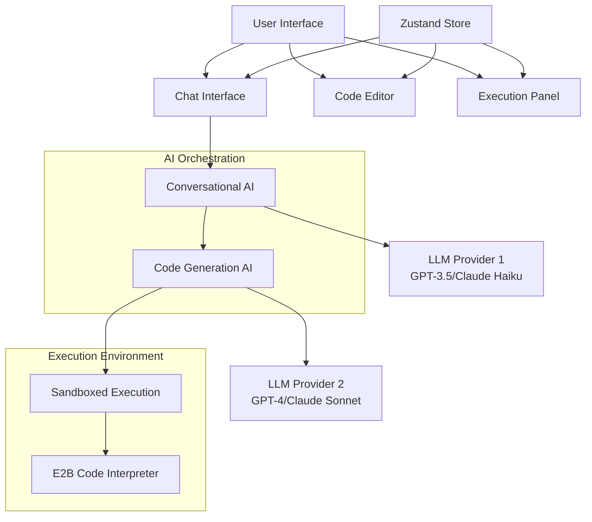
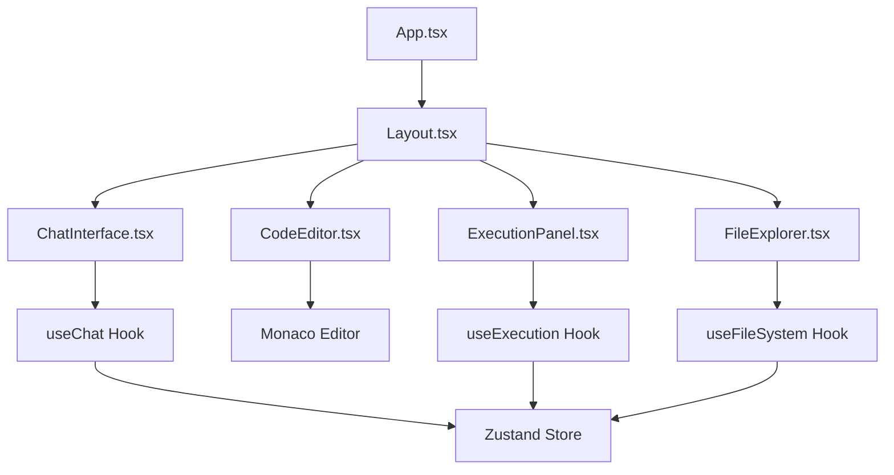
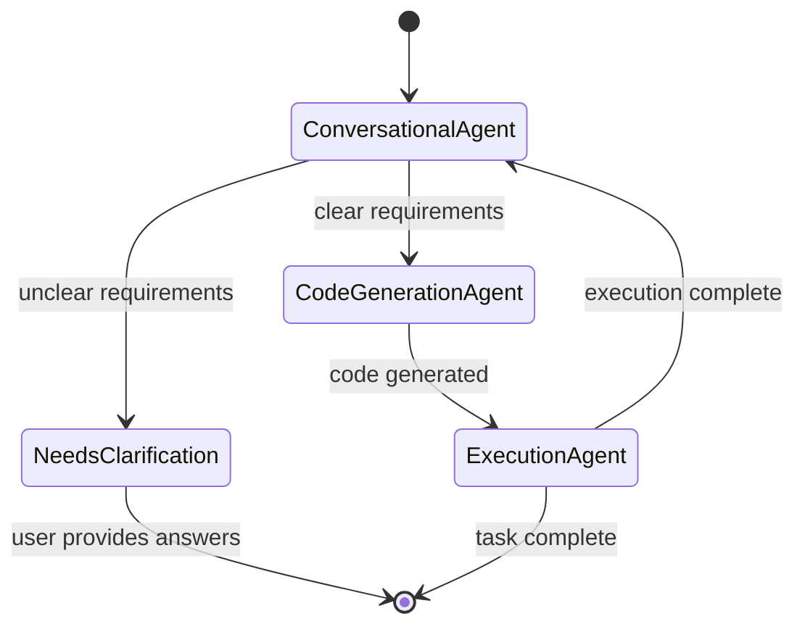

# AI Coding Assistant - Architecture Documentation

## System Overview

The AI Coding Assistant is a web-based application that implements a **dual-AI architecture** to provide intelligent code generation and execution capabilities. The system consists of two specialized AI agents working in coordination: a Conversational AI for user interaction and requirement gathering, and a Code Generation AI for technical implementation.

## High-Level Architecture



## Dual-AI System Design

### Conversational AI (Frontend Agent)
- **Purpose**: User-facing interaction, requirement gathering, task refinement
- **Model**: Faster, cost-effective models (GPT-3.5-turbo, Claude Haiku)
- **Responsibilities**:
  - Parse user intent from natural language
  - Ask clarifying questions when requirements are unclear
  - Build context through conversation history
  - Generate refined, structured prompts for code generation
  - Present results to user in conversational format

### Code Generation AI (Backend Agent)
- **Purpose**: Technical implementation, code synthesis, file operations
- **Model**: More powerful models (GPT-4, Claude Sonnet)
- **Responsibilities**:
  - Receive structured prompts from conversational AI
  - Generate high-quality, working code solutions
  - Execute file operations and project management
  - Run tests and validations
  - Report implementation status back to conversational AI

## Communication Protocol

The two AI agents communicate through a structured message format:

```typescript
interface AgentMessage {
  conversationId: string;
  userIntent: string;
  refinedRequirements: {
    techStack: string[];
    features: string[];
    database?: string;
    additionalConstraints: string[];
  };
  clarifications: Array<{
    question: string;
    answer: string;
  }>;
  priority: 'low' | 'medium' | 'high';
  estimatedComplexity: 'simple' | 'medium' | 'complex';
}
```

## Component Architecture

### Frontend Components



### State Management

The application uses Zustand for state management with the following structure:

```typescript
interface AppState {
  // Conversation State
  messages: Message[];
  userIntent: string;
  needsClarification: boolean;
  clarificationQuestions: string[];
  refinedPrompt: string;
  
  // Code State
  generatedCode: string;
  codeLanguage: string;
  executionResult: ExecutionResult | null;
  
  // UI State
  theme: 'light' | 'dark';
  activePanel: 'chat' | 'editor' | 'execution';
  isLoading: boolean;
}
```

## Service Layer Architecture

### LLM Provider Service
- **Purpose**: Unified interface for multiple LLM providers
- **Supported Providers**: OpenAI, Anthropic, Google, Local (Ollama)
- **Features**: Automatic retries, cost tracking, model switching

### Sandbox Service
- **Purpose**: Secure code execution environment
- **Implementation**: E2B Code Interpreter
- **Features**: Multi-language support, file system access, resource limits

### File System Service
- **Purpose**: Virtual file system management
- **Implementation**: In-memory file system with persistence
- **Features**: File operations, project structure, multi-file support

## AI Orchestration with LangGraph

The dual-AI system is orchestrated using LangGraph for state management and workflow control:



## Security Architecture

### API Key Management
- Environment variable storage
- Client-side encryption for sensitive data
- No hardcoded credentials

### Sandboxed Execution
- Resource limits (CPU, memory, time)
- Network isolation
- File system restrictions
- Code sanitization and validation

### Data Protection
- Local-first architecture
- Encrypted conversation storage
- No telemetry without opt-in
- GDPR compliance ready

## Performance Considerations

### Optimization Strategies
- Code splitting for route-based loading
- Lazy loading for Monaco Editor
- Request debouncing for API calls
- Response caching for repeated queries
- Bundle size optimization

### Performance Targets
- Initial load: < 3 seconds
- Time to interactive: < 5 seconds
- Bundle size: < 500KB gzipped
- LLM response time: < 10 seconds

## Deployment Architecture

### Development Environment
- Local development with Vite
- Hot module replacement
- TypeScript compilation
- ESLint and Prettier integration

### Production Deployment
- Static site generation
- CDN distribution
- Environment variable configuration
- API key management

## Technology Stack

### Frontend
- **Framework**: React 18 with TypeScript
- **Build Tool**: Vite
- **State Management**: Zustand
- **Code Editor**: Monaco Editor
- **UI Components**: Custom components with CSS modules

### AI Integration
- **Orchestration**: LangGraph
- **LLM Providers**: OpenAI, Anthropic, Google
- **Local Models**: Ollama integration
- **Execution**: E2B Code Interpreter

### Development Tools
- **Package Manager**: pnpm
- **Linting**: ESLint
- **Formatting**: Prettier
- **Testing**: Vitest
- **Type Checking**: TypeScript

## Future Architecture Considerations

### Phase 2: Electron Desktop App
- Port web application to Electron
- Native file system integration
- System tray and menu support
- Cross-platform packaging

### Phase 3: VS Code Extension
- Study Continue.dev architecture
- Implement VS Code extension API
- Workspace integration
- Extension marketplace

### Phase 4: Advanced Features
- Multi-file project support
- Git integration
- Terminal integration
- Team collaboration features
- Cloud synchronization

## API Documentation

### LLM Provider API

```typescript
interface LLMProvider {
  chat(
    provider: 'openai' | 'anthropic' | 'google' | 'ollama',
    model: string,
    messages: LLMMessage[],
    options?: ChatOptions
  ): Promise<LLMResponse>;
}

interface ChatOptions {
  stream?: boolean;
  temperature?: number;
  maxTokens?: number;
}
```

### Sandbox Service API

```typescript
interface SandboxService {
  executeCode(
    code: string,
    language: string,
    options?: ExecutionOptions
  ): Promise<ExecutionResult>;
}

interface ExecutionOptions {
  timeout?: number;
  memoryLimit?: number;
  allowNetworkAccess?: boolean;
}
```

### File System Service API

```typescript
interface FileSystemService {
  createFile(path: string, content: string): Promise<void>;
  readFile(path: string): Promise<string>;
  deleteFile(path: string): Promise<void>;
  listFiles(directory: string): Promise<FileNode[]>;
}
```

## Monitoring and Observability

### Metrics Collection
- User interaction patterns
- Code generation success rates
- Execution performance metrics
- Error rates and types

### Logging Strategy
- Structured logging with levels
- Error tracking and reporting
- Performance monitoring
- User behavior analytics

## Scalability Considerations

### Horizontal Scaling
- Stateless application design
- CDN distribution
- Load balancing for API calls
- Caching strategies

### Vertical Scaling
- Memory optimization
- CPU usage monitoring
- Database connection pooling
- Resource limit management

---

**Document Version**: 1.0  
**Last Updated**: October 24, 2025  
**Status**: Draft - Ready for Review
