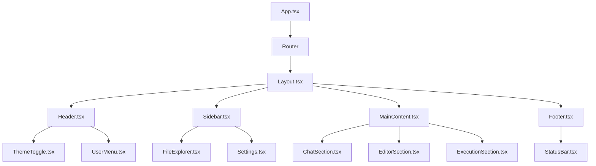
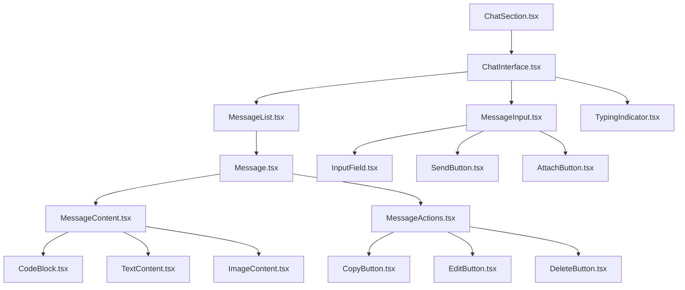
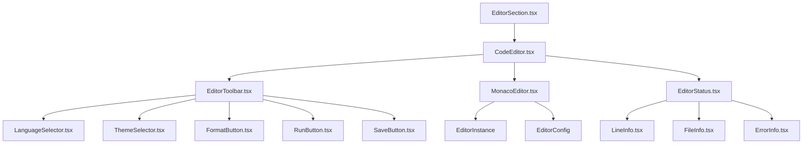
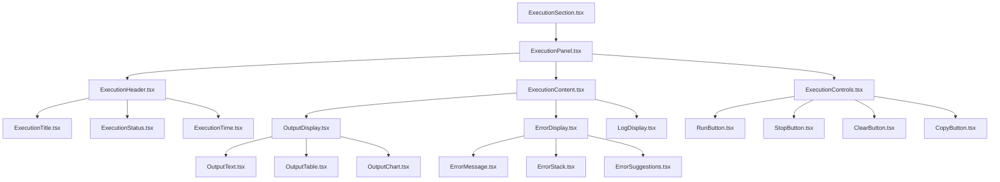
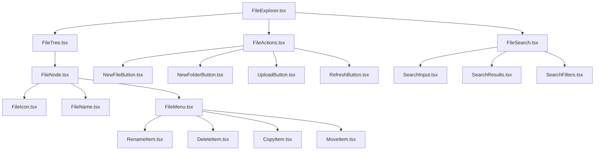
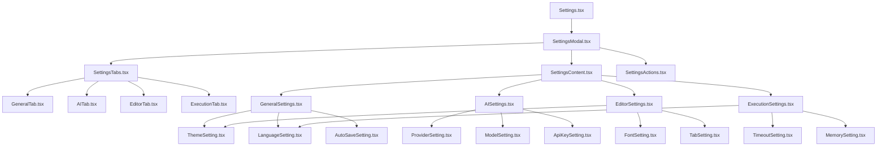
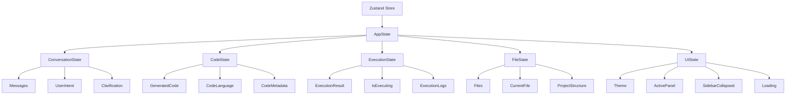
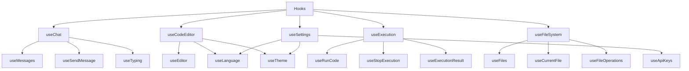

# Component Hierarchy Documentation

## Overview

This document outlines the component hierarchy and relationships within the AI Coding Assistant application. The architecture follows a modular design pattern with clear separation of concerns between UI components, business logic, and data management.

## Main Application Structure



## Chat Interface Components



## Code Editor Components



## Execution Panel Components



## File Explorer Components



## Settings Components



## State Management Components



## Service Layer Components

```mermaid
graph TD
    Services[Services] --> LLMService[LLMService]
    Services --> SandboxService[SandboxService]
    Services --> FileSystemService[FileSystemService]
    Services --> AgentService[AgentService]
    
    LLMService --> OpenAIProvider[OpenAIProvider]
    LLMService --> AnthropicProvider[AnthropicProvider]
    LLMService --> GoogleProvider[GoogleProvider]
    LLMService --> OllamaProvider[OllamaProvider]
    
    SandboxService --> E2BClient[E2BClient]
    SandboxService --> DockerClient[DockerClient]
    SandboxService --> WebContainerClient[WebContainerClient]
    
    FileSystemService --> VirtualFS[VirtualFS]
    FileSystemService --> LocalFS[LocalFS]
    FileSystemService --> CloudFS[CloudFS]
    
    AgentService --> ConversationalAgent[ConversationalAgent]
    AgentService --> CodeGenerationAgent[CodeGenerationAgent]
    AgentService --> ExecutionAgent[ExecutionAgent]
    AgentService --> WorkflowOrchestrator[WorkflowOrchestrator]
```



## Hook Components



## Component Props and Interfaces

### Core Component Props

```typescript
// Base component props
interface BaseComponentProps {
  className?: string;
  children?: React.ReactNode;
  id?: string;
}

// Chat interface props
interface ChatInterfaceProps extends BaseComponentProps {
  messages: Message[];
  onSendMessage: (message: string) => void;
  isLoading: boolean;
  onClearMessages: () => void;
}

// Code editor props
interface CodeEditorProps extends BaseComponentProps {
  code: string;
  language: string;
  onChange: (code: string) => void;
  onRun: () => void;
  readOnly?: boolean;
}

// Execution panel props
interface ExecutionPanelProps extends BaseComponentProps {
  result: ExecutionResult | null;
  isExecuting: boolean;
  onRun: () => void;
  onStop: () => void;
  onClear: () => void;
}

// File explorer props
interface FileExplorerProps extends BaseComponentProps {
  files: FileNode[];
  currentFile: string | null;
  onFileSelect: (filePath: string) => void;
  onFileCreate: (name: string, type: 'file' | 'folder') => void;
  onFileDelete: (filePath: string) => void;
}
```

## Component Lifecycle and State Management

### Component Mounting
1. **App.tsx**: Initialize application state and routing
2. **Layout.tsx**: Set up main layout structure
3. **Individual Components**: Initialize component-specific state

### State Updates
1. **User Interaction**: Trigger state updates through actions
2. **AI Responses**: Update conversation state
3. **Code Generation**: Update code state
4. **Execution Results**: Update execution state

### Component Unmounting
1. **Cleanup**: Remove event listeners and subscriptions
2. **State Persistence**: Save important state to localStorage
3. **Resource Cleanup**: Close connections and clear timers

## Performance Considerations

### Component Optimization
- **React.memo**: Prevent unnecessary re-renders
- **useMemo**: Cache expensive calculations
- **useCallback**: Memoize event handlers
- **Lazy Loading**: Load components on demand

### State Management Optimization
- **Selective Subscriptions**: Only subscribe to needed state slices
- **State Normalization**: Keep state flat and normalized
- **Batch Updates**: Group multiple state updates

### Rendering Optimization
- **Virtual Scrolling**: For large message lists
- **Debounced Input**: For search and input fields
- **Conditional Rendering**: Only render visible components

## Testing Strategy

### Unit Testing
- Test individual components in isolation
- Mock external dependencies
- Test component props and state changes

### Integration Testing
- Test component interactions
- Test state management flows
- Test API integrations

### End-to-End Testing
- Test complete user workflows
- Test cross-browser compatibility
- Test performance under load

---

**Document Version**: 1.0  
**Last Updated**: October 24, 2025  
**Status**: Draft - Ready for Implementation
