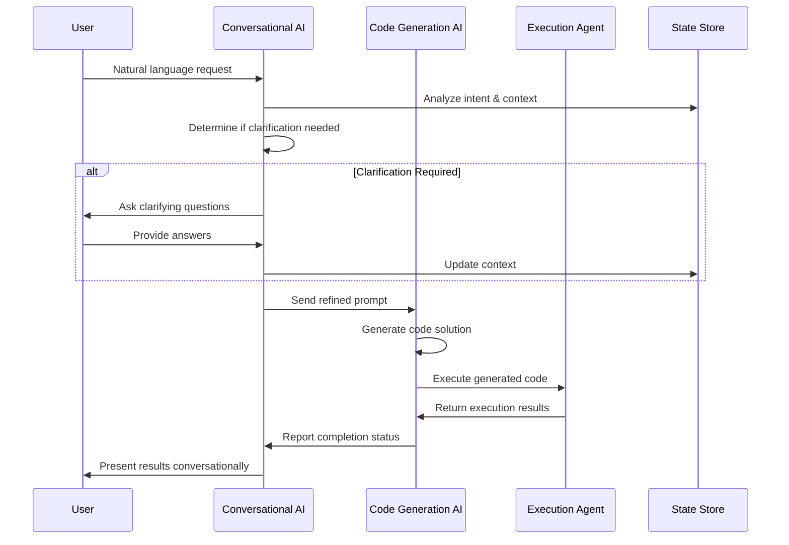

# Dual-AI Communication Protocol

## Overview

The dual-AI system implements a sophisticated communication protocol between two specialized AI agents: the Conversational AI and the Code Generation AI. This protocol ensures efficient information flow, context preservation, and coordinated task execution.

## Communication Flow



## Message Format Specifications

### 1. User Input Message

```typescript
interface UserInputMessage {
  id: string;
  type: 'user_input';
  content: string;
  timestamp: number;
  context: {
    conversationHistory: Message[];
    currentProject: ProjectContext;
    userPreferences: UserPreferences;
  };
}
```

### 2. Conversational AI Response

```typescript
interface ConversationalAIResponse {
  id: string;
  type: 'conversational_response';
  needsClarification: boolean;
  clarificationQuestions?: string[];
  refinedPrompt?: string;
  userIntent: string;
  confidence: number;
  suggestedActions: string[];
  timestamp: number;
}
```

### 3. Code Generation Request

```typescript
interface CodeGenerationRequest {
  id: string;
  type: 'code_generation_request';
  refinedPrompt: string;
  requirements: {
    techStack: string[];
    features: string[];
    constraints: string[];
    quality: 'draft' | 'production' | 'optimized';
  };
  context: {
    projectType: string;
    existingCode?: string;
    dependencies?: string[];
  };
  preferences: {
    language: string;
    framework?: string;
    style: 'functional' | 'object-oriented' | 'procedural';
  };
}
```

### 4. Code Generation Response

```typescript
interface CodeGenerationResponse {
  id: string;
  type: 'code_generation_response';
  generatedCode: string;
  language: string;
  explanation: string;
  metadata: {
    complexity: 'simple' | 'medium' | 'complex';
    estimatedTime: number;
    dependencies: string[];
    testCoverage: number;
  };
  suggestions: {
    improvements: string[];
    alternatives: string[];
    nextSteps: string[];
  };
}
```

### 5. Execution Request

```typescript
interface ExecutionRequest {
  id: string;
  type: 'execution_request';
  code: string;
  language: string;
  options: {
    timeout: number;
    memoryLimit: number;
    allowNetworkAccess: boolean;
    allowFileSystemAccess: boolean;
  };
  context: {
    projectFiles: FileNode[];
    environment: string;
  };
}
```

### 6. Execution Response

```typescript
interface ExecutionResponse {
  id: string;
  type: 'execution_response';
  success: boolean;
  output: string;
  error?: string;
  logs: LogEntry[];
  performance: {
    executionTime: number;
    memoryUsed: number;
    cpuTime: number;
  };
  artifacts: {
    generatedFiles: FileNode[];
    modifiedFiles: FileNode[];
  };
}
```

## Agent State Management

### Conversational AI State

```typescript
interface ConversationalAIState {
  conversationId: string;
  userProfile: {
    experienceLevel: 'beginner' | 'intermediate' | 'advanced';
    preferredLanguages: string[];
    codingStyle: string;
  };
  context: {
    currentProject: ProjectContext;
    conversationHistory: Message[];
    activeTopics: string[];
  };
  intent: {
    primary: string;
    secondary: string[];
    confidence: number;
  };
  clarification: {
    needed: boolean;
    questions: ClarificationQuestion[];
    answers: Record<string, string>;
  };
}
```

### Code Generation AI State

```typescript
interface CodeGenerationAIState {
  taskId: string;
  requirements: {
    functional: string[];
    nonFunctional: string[];
    constraints: string[];
  };
  technical: {
    architecture: string;
    patterns: string[];
    libraries: string[];
  };
  quality: {
    standards: string[];
    testing: TestRequirements;
    documentation: DocumentationRequirements;
  };
  progress: {
    phase: 'analysis' | 'design' | 'implementation' | 'testing' | 'complete';
    completion: number;
    blockers: string[];
  };
}
```

## Communication Patterns

### 1. Clarification Pattern

When the Conversational AI determines that user requirements are unclear:

```typescript
interface ClarificationPattern {
  trigger: 'unclear_requirements' | 'ambiguous_intent' | 'missing_context';
  process: {
    analyze: (userInput: string, context: ConversationContext) => AnalysisResult;
    generate: (analysis: AnalysisResult) => ClarificationQuestion[];
    present: (questions: ClarificationQuestion[]) => UserInteraction;
    integrate: (answers: Record<string, string>) => RefinedRequirements;
  };
}
```

### 2. Refinement Pattern

When requirements are clear and need to be structured for code generation:

```typescript
interface RefinementPattern {
  input: {
    userIntent: string;
    conversationHistory: Message[];
    projectContext: ProjectContext;
  };
  process: {
    extract: (input: RefinementInput) => Requirements;
    structure: (requirements: Requirements) => StructuredPrompt;
    validate: (prompt: StructuredPrompt) => ValidationResult;
    optimize: (prompt: StructuredPrompt) => OptimizedPrompt;
  };
  output: {
    refinedPrompt: string;
    technicalSpecs: TechnicalSpecifications;
    qualityRequirements: QualityRequirements;
  };
}
```

### 3. Code Generation Pattern

When the Code Generation AI receives a structured prompt:

```typescript
interface CodeGenerationPattern {
  input: {
    refinedPrompt: string;
    technicalSpecs: TechnicalSpecifications;
    qualityRequirements: QualityRequirements;
  };
  process: {
    analyze: (prompt: string) => CodeAnalysis;
    design: (analysis: CodeAnalysis) => CodeDesign;
    implement: (design: CodeDesign) => CodeImplementation;
    validate: (code: string) => ValidationResult;
    optimize: (code: string) => OptimizedCode;
  };
  output: {
    generatedCode: string;
    explanation: string;
    metadata: CodeMetadata;
  };
}
```

### 4. Execution Pattern

When code needs to be executed and tested:

```typescript
interface ExecutionPattern {
  input: {
    code: string;
    language: string;
    environment: ExecutionEnvironment;
  };
  process: {
    prepare: (input: ExecutionInput) => PreparedEnvironment;
    execute: (environment: PreparedEnvironment) => ExecutionResult;
    analyze: (result: ExecutionResult) => AnalysisResult;
    report: (analysis: AnalysisResult) => ExecutionReport;
  };
  output: {
    success: boolean;
    results: ExecutionResults;
    recommendations: string[];
  };
}
```

## Error Handling and Recovery

### Error Types

```typescript
interface AIError {
  type: 'communication' | 'execution' | 'validation' | 'timeout';
  severity: 'low' | 'medium' | 'high' | 'critical';
  message: string;
  context: {
    agent: 'conversational' | 'code_generation' | 'execution';
    phase: string;
    timestamp: number;
  };
  recovery: {
    automatic: boolean;
    actions: RecoveryAction[];
    fallback: FallbackStrategy;
  };
}
```

### Recovery Strategies

```typescript
interface RecoveryStrategy {
  communication: {
    retry: (attempts: number) => Promise<boolean>;
    fallback: () => Promise<AlternativeResponse>;
    escalate: () => Promise<HumanIntervention>;
  };
  execution: {
    retry: (code: string, options: ExecutionOptions) => Promise<ExecutionResult>;
    simplify: (code: string) => Promise<string>;
    alternative: (requirements: string) => Promise<string>;
  };
  validation: {
    fix: (code: string, errors: ValidationError[]) => Promise<string>;
    regenerate: (prompt: string) => Promise<string>;
    manual: () => Promise<ManualIntervention>;
  };
}
```

## Performance Optimization

### Caching Strategy

```typescript
interface CacheStrategy {
  conversation: {
    ttl: number; // Time to live in seconds
    maxSize: number; // Maximum number of cached conversations
    eviction: 'lru' | 'fifo' | 'ttl';
  };
  code: {
    ttl: number;
    maxSize: number;
    compression: boolean;
  };
  execution: {
    ttl: number;
    maxSize: number;
    cleanup: boolean;
  };
}
```

### Load Balancing

```typescript
interface LoadBalancing {
  llm: {
    strategy: 'round_robin' | 'least_connections' | 'weighted';
    providers: LLMProvider[];
    weights: Record<LLMProvider, number>;
  };
  execution: {
    strategy: 'round_robin' | 'least_loaded' | 'geographic';
    sandboxes: SandboxInstance[];
    health: HealthCheck[];
  };
}
```

## Monitoring and Observability

### Metrics Collection

```typescript
interface Metrics {
  communication: {
    messageLatency: number;
    clarificationRate: number;
    refinementAccuracy: number;
  };
  generation: {
    codeQuality: number;
    generationTime: number;
    successRate: number;
  };
  execution: {
    executionTime: number;
    successRate: number;
    resourceUsage: ResourceUsage;
  };
}
```

### Logging Strategy

```typescript
interface LoggingConfig {
  level: 'debug' | 'info' | 'warn' | 'error';
  format: 'json' | 'text';
  destinations: LogDestination[];
  retention: {
    duration: number;
    size: number;
  };
}
```

## Security Considerations

### Data Protection

```typescript
interface SecurityConfig {
  encryption: {
    inTransit: boolean;
    atRest: boolean;
    algorithm: string;
  };
  access: {
    authentication: boolean;
    authorization: boolean;
    rateLimit: RateLimitConfig;
  };
  privacy: {
    dataRetention: number;
    anonymization: boolean;
    consent: boolean;
  };
}
```

### Sandbox Security

```typescript
interface SandboxSecurity {
  isolation: {
    network: boolean;
    filesystem: boolean;
    process: boolean;
  };
  limits: {
    cpu: number;
    memory: number;
    time: number;
    disk: number;
  };
  monitoring: {
    realTime: boolean;
    alerts: boolean;
    logging: boolean;
  };
}
```

---

**Document Version**: 1.0  
**Last Updated**: October 24, 2025  
**Status**: Draft - Ready for Implementation
