# State Management Strategy with Zustand

## Overview

The AI Coding Assistant uses Zustand for state management, providing a lightweight, TypeScript-first solution for managing application state. The state is organized into logical slices that correspond to different aspects of the application.

## State Architecture

```mermaid
graph TD
    AppState[AppState] --> ConversationSlice[Conversation Slice]
    AppState --> CodeSlice[Code Slice]
    AppState --> ExecutionSlice[Execution Slice]
    AppState --> FileSlice[File Slice]
    AppState --> UISlice[UI Slice]
    
    ConversationSlice --> Messages[Messages]
    ConversationSlice --> UserIntent[User Intent]
    ConversationSlice --> Clarification[Clarification]
    
    CodeSlice --> GeneratedCode[Generated Code]
    CodeSlice --> CodeLanguage[Code Language]
    CodeSlice --> CodeMetadata[Code Metadata]
    
    ExecutionSlice --> ExecutionResult[Execution Result]
    ExecutionSlice --> IsExecuting[Is Executing]
    ExecutionSlice --> ExecutionLogs[Execution Logs]
    
    FileSlice --> Files[Files]
    FileSlice --> CurrentFile[Current File]
    FileSlice --> ProjectStructure[Project Structure]
    
    UISlice --> Theme[Theme]
    UISlice --> ActivePanel[Active Panel]
    UISlice --> SidebarCollapsed[Sidebar Collapsed]
    UISlice --> Loading[Loading State]
```



## Store Implementation

### Main Store Structure

```typescript
// src/store/app-state.ts
import { create } from 'zustand';
import { persist, createJSONStorage } from 'zustand/middleware';
import { immer } from 'zustand/middleware/immer';

interface AppState {
  // Conversation State
  messages: Message[];
  userIntent: string;
  needsClarification: boolean;
  clarificationQuestions: string[];
  refinedPrompt: string;
  
  // Code State
  generatedCode: string;
  codeLanguage: string;
  executionResult: ExecutionResult | null;
  isExecuting: boolean;
  
  // File State
  files: FileNode[];
  currentFile: string | null;
  projectStructure: FileNode[];
  
  // UI State
  theme: 'light' | 'dark';
  activePanel: 'chat' | 'editor' | 'execution' | 'files';
  sidebarCollapsed: boolean;
  isLoading: boolean;
  error: string | null;
  
  // Actions
  // Conversation Actions
  addMessage: (message: Message) => void;
  clearMessages: () => void;
  setUserIntent: (intent: string) => void;
  setNeedsClarification: (needs: boolean) => void;
  setClarificationQuestions: (questions: string[]) => void;
  setRefinedPrompt: (prompt: string) => void;
  
  // Code Actions
  setGeneratedCode: (code: string, language: string) => void;
  setExecutionResult: (result: ExecutionResult) => void;
  setIsExecuting: (executing: boolean) => void;
  
  // File Actions
  setCurrentFile: (filePath: string | null) => void;
  addFile: (file: FileNode) => void;
  updateFile: (path: string, content: string) => void;
  deleteFile: (path: string) => void;
  setProjectStructure: (structure: FileNode[]) => void;
  
  // UI Actions
  setTheme: (theme: 'light' | 'dark') => void;
  setActivePanel: (panel: 'chat' | 'editor' | 'execution' | 'files') => void;
  setSidebarCollapsed: (collapsed: boolean) => void;
  setLoading: (loading: boolean) => void;
  setError: (error: string | null) => void;
  
  // Complex Actions
  processUserMessage: (content: string) => Promise<void>;
  generateCode: (prompt: string) => Promise<void>;
  executeCode: (code: string, language: string) => Promise<void>;
  resetApplication: () => void;
}
```

### Store Implementation with Middleware

```typescript
export const useAppStore = create<AppState>()(
  persist(
    immer((set, get) => ({
      // Initial State
      messages: [],
      userIntent: '',
      needsClarification: false,
      clarificationQuestions: [],
      refinedPrompt: '',
      
      generatedCode: '',
      codeLanguage: 'typescript',
      executionResult: null,
      isExecuting: false,
      
      files: [],
      currentFile: null,
      projectStructure: [],
      
      theme: 'dark',
      activePanel: 'chat',
      sidebarCollapsed: false,
      isLoading: false,
      error: null,
      
      // Conversation Actions
      addMessage: (message: Message) => set((state) => {
        state.messages.push(message);
      }),
      
      clearMessages: () => set((state) => {
        state.messages = [];
        state.userIntent = '';
        state.needsClarification = false;
        state.clarificationQuestions = [];
        state.refinedPrompt = '';
      }),
      
      setUserIntent: (intent: string) => set((state) => {
        state.userIntent = intent;
      }),
      
      setNeedsClarification: (needs: boolean) => set((state) => {
        state.needsClarification = needs;
      }),
      
      setClarificationQuestions: (questions: string[]) => set((state) => {
        state.clarificationQuestions = questions;
      }),
      
      setRefinedPrompt: (prompt: string) => set((state) => {
        state.refinedPrompt = prompt;
      }),
      
      // Code Actions
      setGeneratedCode: (code: string, language: string) => set((state) => {
        state.generatedCode = code;
        state.codeLanguage = language;
      }),
      
      setExecutionResult: (result: ExecutionResult) => set((state) => {
        state.executionResult = result;
      }),
      
      setIsExecuting: (executing: boolean) => set((state) => {
        state.isExecuting = executing;
      }),
      
      // File Actions
      setCurrentFile: (filePath: string | null) => set((state) => {
        state.currentFile = filePath;
      }),
      
      addFile: (file: FileNode) => set((state) => {
        state.files.push(file);
        // Update project structure
        updateProjectStructure(state, file);
      }),
      
      updateFile: (path: string, content: string) => set((state) => {
        const file = state.files.find(f => f.path === path);
        if (file) {
          file.content = content;
          file.lastModified = Date.now();
        }
      }),
      
      deleteFile: (path: string) => set((state) => {
        state.files = state.files.filter(f => f.path !== path);
        if (state.currentFile === path) {
          state.currentFile = null;
        }
        // Update project structure
        removeFromProjectStructure(state, path);
      }),
      
      setProjectStructure: (structure: FileNode[]) => set((state) => {
        state.projectStructure = structure;
      }),
      
      // UI Actions
      setTheme: (theme: 'light' | 'dark') => set((state) => {
        state.theme = theme;
      }),
      
      setActivePanel: (panel: 'chat' | 'editor' | 'execution' | 'files') => set((state) => {
        state.activePanel = panel;
      }),
      
      setSidebarCollapsed: (collapsed: boolean) => set((state) => {
        state.sidebarCollapsed = collapsed;
      }),
      
      setLoading: (loading: boolean) => set((state) => {
        state.isLoading = loading;
      }),
      
      setError: (error: string | null) => set((state) => {
        state.error = error;
      }),
      
      // Complex Actions
      processUserMessage: async (content: string) => {
        const { addMessage, setLoading, setError } = get();
        
        try {
          setLoading(true);
          setError(null);
          
          // Add user message
          const userMessage: Message = {
            id: nanoid(),
            role: 'user',
            content,
            timestamp: Date.now(),
          };
          addMessage(userMessage);
          
          // Process with conversational AI
          const response = await processWithConversationalAI(content);
          
          // Add AI response
          const aiMessage: Message = {
            id: nanoid(),
            role: 'assistant',
            content: response.content,
            timestamp: Date.now(),
            agentType: 'conversational',
          };
          addMessage(aiMessage);
          
        } catch (error) {
          setError(error instanceof Error ? error.message : 'Unknown error');
        } finally {
          setLoading(false);
        }
      },
      
      generateCode: async (prompt: string) => {
        const { setGeneratedCode, setLoading, setError } = get();
        
        try {
          setLoading(true);
          setError(null);
          
          // Generate code with AI
          const result = await generateCodeWithAI(prompt);
          setGeneratedCode(result.code, result.language);
          
        } catch (error) {
          setError(error instanceof Error ? error.message : 'Code generation failed');
        } finally {
          setLoading(false);
        }
      },
      
      executeCode: async (code: string, language: string) => {
        const { setExecutionResult, setIsExecuting, setError } = get();
        
        try {
          setIsExecuting(true);
          setError(null);
          
          // Execute code in sandbox
          const result = await executeCodeInSandbox(code, language);
          setExecutionResult(result);
          
        } catch (error) {
          setError(error instanceof Error ? error.message : 'Execution failed');
        } finally {
          setIsExecuting(false);
        }
      },
      
      resetApplication: () => set((state) => {
        state.messages = [];
        state.userIntent = '';
        state.needsClarification = false;
        state.clarificationQuestions = [];
        state.refinedPrompt = '';
        state.generatedCode = '';
        state.codeLanguage = 'typescript';
        state.executionResult = null;
        state.isExecuting = false;
        state.files = [];
        state.currentFile = null;
        state.projectStructure = [];
        state.error = null;
      }),
    })),
    {
      name: 'ai-coding-assistant-storage',
      storage: createJSONStorage(() => localStorage),
      partialize: (state) => ({
        theme: state.theme,
        activePanel: state.activePanel,
        sidebarCollapsed: state.sidebarCollapsed,
        projectStructure: state.projectStructure,
      }),
    }
  )
);
```

## State Slices

### Conversation Slice

```typescript
// src/store/slices/conversation-slice.ts
interface ConversationSlice {
  messages: Message[];
  userIntent: string;
  needsClarification: boolean;
  clarificationQuestions: string[];
  refinedPrompt: string;
  
  // Actions
  addMessage: (message: Message) => void;
  clearMessages: () => void;
  setUserIntent: (intent: string) => void;
  setNeedsClarification: (needs: boolean) => void;
  setClarificationQuestions: (questions: string[]) => void;
  setRefinedPrompt: (prompt: string) => void;
  processMessage: (content: string) => Promise<void>;
}
```

### Code Slice

```typescript
// src/store/slices/code-slice.ts
interface CodeSlice {
  generatedCode: string;
  codeLanguage: string;
  executionResult: ExecutionResult | null;
  isExecuting: boolean;
  
  // Actions
  setGeneratedCode: (code: string, language: string) => void;
  setExecutionResult: (result: ExecutionResult) => void;
  setIsExecuting: (executing: boolean) => void;
  generateCode: (prompt: string) => Promise<void>;
  executeCode: (code: string, language: string) => Promise<void>;
}
```

### File Slice

```typescript
// src/store/slices/file-slice.ts
interface FileSlice {
  files: FileNode[];
  currentFile: string | null;
  projectStructure: FileNode[];
  
  // Actions
  setCurrentFile: (filePath: string | null) => void;
  addFile: (file: FileNode) => void;
  updateFile: (path: string, content: string) => void;
  deleteFile: (path: string) => void;
  setProjectStructure: (structure: FileNode[]) => void;
  createFile: (name: string, content: string) => Promise<void>;
  readFile: (path: string) => Promise<string>;
}
```

### UI Slice

```typescript
// src/store/slices/ui-slice.ts
interface UISlice {
  theme: 'light' | 'dark';
  activePanel: 'chat' | 'editor' | 'execution' | 'files';
  sidebarCollapsed: boolean;
  isLoading: boolean;
  error: string | null;
  
  // Actions
  setTheme: (theme: 'light' | 'dark') => void;
  setActivePanel: (panel: 'chat' | 'editor' | 'execution' | 'files') => void;
  setSidebarCollapsed: (collapsed: boolean) => void;
  setLoading: (loading: boolean) => void;
  setError: (error: string | null) => void;
  toggleTheme: () => void;
  toggleSidebar: () => void;
}
```

## Custom Hooks

### useConversation Hook

```typescript
// src/hooks/useConversation.ts
export const useConversation = () => {
  const messages = useAppStore((state) => state.messages);
  const userIntent = useAppStore((state) => state.userIntent);
  const needsClarification = useAppStore((state) => state.needsClarification);
  const clarificationQuestions = useAppStore((state) => state.clarificationQuestions);
  const refinedPrompt = useAppStore((state) => state.refinedPrompt);
  
  const addMessage = useAppStore((state) => state.addMessage);
  const clearMessages = useAppStore((state) => state.clearMessages);
  const setUserIntent = useAppStore((state) => state.setUserIntent);
  const setNeedsClarification = useAppStore((state) => state.setNeedsClarification);
  const setClarificationQuestions = useAppStore((state) => state.setClarificationQuestions);
  const setRefinedPrompt = useAppStore((state) => state.setRefinedPrompt);
  const processMessage = useAppStore((state) => state.processUserMessage);
  
  return {
    messages,
    userIntent,
    needsClarification,
    clarificationQuestions,
    refinedPrompt,
    addMessage,
    clearMessages,
    setUserIntent,
    setNeedsClarification,
    setClarificationQuestions,
    setRefinedPrompt,
    processMessage,
  };
};
```

### useCode Hook

```typescript
// src/hooks/useCode.ts
export const useCode = () => {
  const generatedCode = useAppStore((state) => state.generatedCode);
  const codeLanguage = useAppStore((state) => state.codeLanguage);
  const executionResult = useAppStore((state) => state.executionResult);
  const isExecuting = useAppStore((state) => state.isExecuting);
  
  const setGeneratedCode = useAppStore((state) => state.setGeneratedCode);
  const setExecutionResult = useAppStore((state) => state.setExecutionResult);
  const setIsExecuting = useAppStore((state) => state.setIsExecuting);
  const generateCode = useAppStore((state) => state.generateCode);
  const executeCode = useAppStore((state) => state.executeCode);
  
  return {
    generatedCode,
    codeLanguage,
    executionResult,
    isExecuting,
    setGeneratedCode,
    setExecutionResult,
    setIsExecuting,
    generateCode,
    executeCode,
  };
};
```

### useFiles Hook

```typescript
// src/hooks/useFiles.ts
export const useFiles = () => {
  const files = useAppStore((state) => state.files);
  const currentFile = useAppStore((state) => state.currentFile);
  const projectStructure = useAppStore((state) => state.projectStructure);
  
  const setCurrentFile = useAppStore((state) => state.setCurrentFile);
  const addFile = useAppStore((state) => state.addFile);
  const updateFile = useAppStore((state) => state.updateFile);
  const deleteFile = useAppStore((state) => state.deleteFile);
  const setProjectStructure = useAppStore((state) => state.setProjectStructure);
  
  return {
    files,
    currentFile,
    projectStructure,
    setCurrentFile,
    addFile,
    updateFile,
    deleteFile,
    setProjectStructure,
  };
};
```

### useUI Hook

```typescript
// src/hooks/useUI.ts
export const useUI = () => {
  const theme = useAppStore((state) => state.theme);
  const activePanel = useAppStore((state) => state.activePanel);
  const sidebarCollapsed = useAppStore((state) => state.sidebarCollapsed);
  const isLoading = useAppStore((state) => state.isLoading);
  const error = useAppStore((state) => state.error);
  
  const setTheme = useAppStore((state) => state.setTheme);
  const setActivePanel = useAppStore((state) => state.setActivePanel);
  const setSidebarCollapsed = useAppStore((state) => state.setSidebarCollapsed);
  const setLoading = useAppStore((state) => state.setLoading);
  const setError = useAppStore((state) => state.setError);
  
  const toggleTheme = () => setTheme(theme === 'dark' ? 'light' : 'dark');
  const toggleSidebar = () => setSidebarCollapsed(!sidebarCollapsed);
  
  return {
    theme,
    activePanel,
    sidebarCollapsed,
    isLoading,
    error,
    setTheme,
    setActivePanel,
    setSidebarCollapsed,
    setLoading,
    setError,
    toggleTheme,
    toggleSidebar,
  };
};
```

## State Persistence

### Persistence Strategy

```typescript
// src/store/persistence.ts
interface PersistenceConfig {
  // What to persist
  persist: {
    theme: boolean;
    activePanel: boolean;
    sidebarCollapsed: boolean;
    projectStructure: boolean;
    userPreferences: boolean;
  };
  
  // What NOT to persist
  exclude: {
    messages: boolean;
    generatedCode: boolean;
    executionResult: boolean;
    isLoading: boolean;
    error: boolean;
  };
  
  // Persistence options
  options: {
    storage: 'localStorage' | 'sessionStorage' | 'indexedDB';
    compression: boolean;
    encryption: boolean;
    version: string;
  };
}
```

### Migration Strategy

```typescript
// src/store/migrations.ts
interface Migration {
  version: string;
  up: (state: any) => any;
  down: (state: any) => any;
}

const migrations: Migration[] = [
  {
    version: '1.0.0',
    up: (state) => ({
      ...state,
      // Add new fields
      newField: 'defaultValue',
    }),
    down: (state) => {
      const { newField, ...rest } = state;
      return rest;
    },
  },
  // Add more migrations as needed
];
```

## Performance Optimization

### Selector Optimization

```typescript
// src/store/selectors.ts
import { createSelector } from 'zustand';

// Memoized selectors
export const selectMessages = createSelector(
  (state: AppState) => state.messages,
  (messages) => messages
);

export const selectCurrentFile = createSelector(
  (state: AppState) => state.currentFile,
  (state: AppState) => state.files,
  (currentFile, files) => files.find(f => f.path === currentFile)
);

export const selectExecutionStatus = createSelector(
  (state: AppState) => state.isExecuting,
  (state: AppState) => state.executionResult,
  (isExecuting, result) => ({
    isExecuting,
    hasResult: !!result,
    success: result?.success,
  })
);
```

### Subscription Optimization

```typescript
// src/store/subscriptions.ts
export const useAppStoreSubscription = <T>(
  selector: (state: AppState) => T,
  equalityFn?: (a: T, b: T) => boolean
) => {
  return useAppStore(selector, equalityFn);
};

// Usage with custom equality function
const messages = useAppStoreSubscription(
  (state) => state.messages,
  (a, b) => a.length === b.length && a.every((msg, i) => msg.id === b[i]?.id)
);
```

## Testing Strategy

### Store Testing

```typescript
// src/store/__tests__/app-state.test.ts
import { renderHook, act } from '@testing-library/react';
import { useAppStore } from '../app-state';

describe('AppState', () => {
  beforeEach(() => {
    useAppStore.getState().resetApplication();
  });
  
  it('should add message', () => {
    const { result } = renderHook(() => useAppStore());
    
    act(() => {
      result.current.addMessage({
        id: '1',
        role: 'user',
        content: 'Hello',
        timestamp: Date.now(),
      });
    });
    
    expect(result.current.messages).toHaveLength(1);
    expect(result.current.messages[0].content).toBe('Hello');
  });
  
  it('should clear messages', () => {
    const { result } = renderHook(() => useAppStore());
    
    act(() => {
      result.current.addMessage({
        id: '1',
        role: 'user',
        content: 'Hello',
        timestamp: Date.now(),
      });
      result.current.clearMessages();
    });
    
    expect(result.current.messages).toHaveLength(0);
  });
});
```

### Hook Testing

```typescript
// src/hooks/__tests__/useConversation.test.ts
import { renderHook, act } from '@testing-library/react';
import { useConversation } from '../useConversation';

describe('useConversation', () => {
  it('should return conversation state and actions', () => {
    const { result } = renderHook(() => useConversation());
    
    expect(result.current.messages).toEqual([]);
    expect(result.current.userIntent).toBe('');
    expect(typeof result.current.addMessage).toBe('function');
    expect(typeof result.current.clearMessages).toBe('function');
  });
});
```

---

**Document Version**: 1.0  
**Last Updated**: October 24, 2025  
**Status**: Draft - Ready for Implementation
